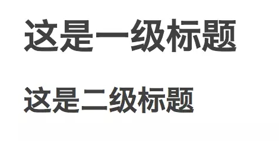

> Markdown是一门比html更简单的标记语言，其主要用于日常写作。最终通过相应的编辑器或者脚本转换成html用于页面渲染。

目录
=================

* [基础语法](#%E5%9F%BA%E7%A1%80%E8%AF%AD%E6%B3%95)
    * [标题](#%E6%A0%87%E9%A2%98)
    * [段落及区块引用](#%E6%AE%B5%E8%90%BD%E5%8F%8A%E5%8C%BA%E5%9D%97%E5%BC%95%E7%94%A8)
    * [插入链接或图片](#%E6%8F%92%E5%85%A5%E9%93%BE%E6%8E%A5%E6%88%96%E5%9B%BE%E7%89%87)
    * [列表](#%E5%88%97%E8%A1%A8)
    * [使用列表的一些注意事项](#%E4%BD%BF%E7%94%A8%E5%88%97%E8%A1%A8%E7%9A%84%E4%B8%80%E4%BA%9B%E6%B3%A8%E6%84%8F%E4%BA%8B%E9%A1%B9)
    * [分隔线](#%E5%88%86%E9%9A%94%E7%BA%BF)
    * [强调](#%E5%BC%BA%E8%B0%83)
* [高级用法](#%E9%AB%98%E7%BA%A7%E7%94%A8%E6%B3%95)
    * [插入代码块](#%E6%8F%92%E5%85%A5%E4%BB%A3%E7%A0%81%E5%9D%97)
    * [插入表格](#%E6%8F%92%E5%85%A5%E8%A1%A8%E6%A0%BC)
* [其它](#%E5%85%B6%E5%AE%83)
    * [特殊符号处理](#%E7%89%B9%E6%AE%8A%E7%AC%A6%E5%8F%B7%E5%A4%84%E7%90%86)
    * [如何给文字上色](#%E5%A6%82%E4%BD%95%E7%BB%99%E6%96%87%E5%AD%97%E4%B8%8A%E8%89%B2)
    * [Markdown软件推荐](#markdown%E8%BD%AF%E4%BB%B6%E6%8E%A8%E8%8D%90)
* [其他资源](#%E5%85%B6%E4%BB%96%E8%B5%84%E6%BA%90)

# 基础语法

### 标题

Markdown支持6种级别的标题，对应html标签 **h1 ~ h6**

```
# h1
## h2
### h3
#### h4
##### h5
###### h6
```

以上标记效果如下：

# h1

## h2

### h3

#### h4

##### h5

###### h6

除此之外，Markdown还支持另外一种形式的标题展示形式，其类似于 [Setext](https://link.jianshu.com/?t=http%3A%2F%2Fdocutils.sourceforge.net%2Fmirror%2Fsetext.html) 标记语言的表现形式，使用下划线进行文本大小的控制

```
这是一级标题
===
这是二级标题
---
```

使用这种方式处理标题仅有两种表现形式，即一级标题和二级标题。



这种处理方式在Github的一些开源工程上面比较常见，显而易见的缺点是：文字大小控制级别有限。

### 段落及区块引用

需要记住的是，Markdown其实就是一种易于编写的普通文本，只不过加入了部分渲染文本的标签而已。其最终依然会转换为html标签，因此使用Markdown分段非常简单，前后至少保留一个空行即可。

而另外一个比较常见的需求就是，我们可能希望对某段文字进行强调处理。Markdown提供了一个特殊符号>用于段首进行强调，被强调的文字部分将会高亮显示

```
> 这段文字将被高亮显示...
```

以上标记显示效果如下：

> 这段文字将被高亮显示...

### 插入链接或图片

Markdown针对链接和图片的处理也比较简单，可以使用下面的语法进行标记

```
[点击跳转至博客](https://mounui.com)

```

以上标记显示效果如下：

[点击跳转至博客](https://mounui.com)


图片

注： 引用图片和链接的唯一区别就是在最前方添加一个感叹号。

### 列表

Markdown支持有序列表和无序列表两种形式：

- 无序列表使用*或+或-标识
- 有序列表使用数字加.标识，例如：1.

```
* 黄瓜
* 玉米
* 茄子

+ 黄瓜
+ 玉米
+ 茄子

- 黄瓜
- 玉米
- 茄子

1. 黄瓜
2. 玉米
3. 茄子
```

以上标记显示效果如下：

- 黄瓜
- 玉米
- 茄子


- 黄瓜
- 玉米
- 茄子


- 黄瓜
- 玉米
- 茄子


1. 黄瓜
2. 玉米
3. 茄子

注：这里比较有趣的地方是，对于有序列表，Markdown将只关注你的第一个项目的数字编号。例如：如果第一个项目编号是3，以此类推，第二个项目应该是4，最终将显示为3、4、5。而如果你指定了第一个编号，后面的编号指定错误也没有关系，Markdown将只在乎你的第一个项目编号。

### 使用列表的一些注意事项

如果在单一列表项中包含了多个段落，为了保证渲染正常，*与段落首字母之间必须保留四个空格

```
*    段落一
     小段一
```

```
*    段落二
     小段二
```

以上标记显示效果如下：

- 段落一

  小段一

- 段落二

  小段二

另外，如果在列表中加入了区块引用，区域引用标记符也需要缩进4个空格

```
* 段落一
    > 区块标记一
```

```
* 段落二
    > 区块标记二
```

- 段落一

  > 区块标记一

- 段落二

  > 区块标记二

注：记住一个原则，如果在和列表配合使用的时候出现了问题，就缩进一次，四个空格或者一个制表符代表一次缩进。如果一次缩进没有解决问题，那就两次。

### 分隔线

有时候，为了排版漂亮，可能会加入分隔线。Markdown加入分隔线非常简单，使用下面任意一种形式都可以

```
***
---
```

------

------

产生分隔线的语法要求比较松，符号之间添加空格也可以。

### 强调

有时候，我们希望对某一部分文字进行强调，使用*或_包裹即可。使用单一符号标记的效果是斜体，使用两个符号标记的效果是加粗

```
*这里是斜体*
_这里是斜体_
**这里是加粗**
__这里是加粗__
```

*这里是斜体**这里是斜体*

**这里是加粗****这里是加粗**

# 高级用法

### 插入代码块

Markdown在IT圈子里面比较流行的一个重要原因是，它能够轻松漂亮地插入代码。

方法是，使用反引号`进行包裹即可。如果是行内代码引用，使用单个反引号进行包裹

这是一段`var x = 3`行内代码

如果插入一整段代码，需要至少使用两个以上反引号进行包裹， 看效果：

```
fun (x: Int, y: Int): Int {
  return x + y
}
```

注：很多人不知道怎么输入反引号。在英文模式下，找到键盘最左侧esc键下面的第一个键点击即可。

### 插入表格

表格是Markdown语法中比较复杂的一个，其语法如下：

```
表头|条目一|条目二
:---:|:---:|:---:
项目|项目一|项目二
```

以上标记显示效果如下：

| 表头 | 条目一 | 条目二 |
| ---- | ------ | ------ |
| 项目 | 项目一 | 项目二 |

注：三个短斜杠左右的冒号用于控制对齐方式，只放置左边冒号表示文字居左，只放置右边冒号表示文字居右，如果两边都放置冒号表示文字居中。

# 其它

### 特殊符号处理

Markdown使用反斜杠\插入语法中用到的特殊符号。在Markdown中，主要有以下几种特殊符号需要处理：

```
\   反斜线
`   反引号
*   星号
_   底线
{}  花括号
[]  方括号
()  括弧
#   井字号
+   加号
-   减号
.   英文句点
!   惊叹号
```

例如，如果你需要插入反斜杠，就连续输入两个反斜杠即可：\ => \ 。

注：在内容中输入以上特殊符号的时候一定要注意转义，否则将导致内容显示不全，甚至排版混乱。

### 如何给文字上色

使用Markdown的同学最郁闷的地方恐怕就是不能给文字添加颜色了。事实上，Markdown的最初目标就是为纯写作而生的。因此，它并没有考虑文字颜色这一点。所以，单纯使用Markdown设置文字颜色已经做不到了。但你可以这样做：

1. 先用Markdown编辑完成
2. 导出为html，在需要上色的部分手动添加标签<font color='#ff0000'></font>保存即可。

### Markdown软件推荐

如果你是一个Mac用户，我推荐你使用开源的 [MacDown](http://macdown.uranusjr.com)：


Macdown

如果你愿意花钱的话，一些收费产品其实更好。例如：Byword，Ulysses，Typora等等都很不错。

日常使用，我就用Macdown。写书，我就用Ulysses。

# 其他资源

- [Markdown 基础语法](https://mounui.com/157.html )
- [Markdown 常用语法](https://github.com/mounui/Markdown/blob/master/Markdown.md)
- [Github Markdown文件生成目录](https://mounui.com/554.html)


